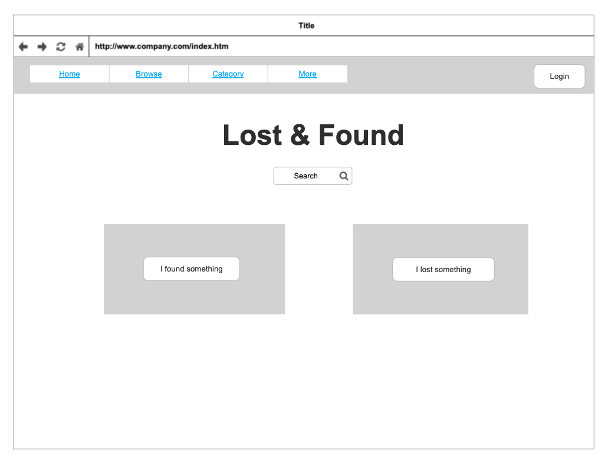

# Lost & Found

## Project Proposal - Lisa Feng

## Project Name

Lost & Found

## Individual/Group

Individual

## Learning Goals

- Learn to use Node JS and Express JS 
- Learn to build a signup and login system

## Project Description

Lost & Found is a website. When we find something, we can post them on the website so that when someone loses something, they can go to the website to see if someone has found theirs belongs. 

## MVP Featureset

-  Users should be able to sign up and log in to the account.
    - When signing up, users should fill out their names, contact info, address/zip code(making sure they are in this area), and create their passwords.
    - Users should be able to log in by using their user names and passwords.
-  Users should be able to create, read, update and delete their own posts.
    - They should be able to post something they found with titles, categories, descriptions, pictures, etc.
    - They should be able to browse the posts of lost items(including pets).
    - They should be able to modify and delete their own posts.
- Users should be able to claim something others post.
    - When someone finds something they lost, they can claim that item.
    - Someone who posts that will see the information about who claimed that.
- Users should be able to search by keyword.

## Main Front-end Technology

React

## Additional Front-End Technologies

CSS

## Main Back-end Technology

JavaScript - Node/Express

## Additional Backend Technologies

None (for now)

## Database

PostgresQL

## Additional Database Technologies

None (for now)

## Misc Technologies if any

maybe added later

## Wireframes

  

